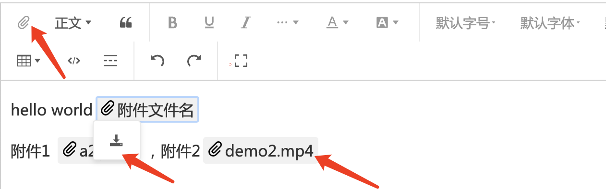

# wangEditor upload-attachment plugin

[中文文档](./README.md)

## Introduction

[wangEditor](https://www.wangeditor.com/en/) upload attachment plugin.



## Installation

```shell
yarn add @wangeditor/plugin-upload-attachment
```

## Usage

### Register to editor

```js
import { Boot } from '@wangeditor/editor'
import attachmentModule from '@wangeditor/plugin-upload-attachment'

// Register
// You should register this before create editor, and register only once (not repeatedly).
Boot.registerModule(attachmentModule)
```

### Configuration

Editor config

```ts
import { IEditorConfig } from '@wangeditor/editor'

const editorConfig: Partial<IEditorConfig> = {
  // Hoverbar keys when selected a attachment node.
  hoverbarKeys: {
    attachment: {
      menuKeys: ['downloadAttachment'], // download attachment menu
    },
  },
  MENU_CONF: {
    // upload attachment menu config
    uploadAttachment: {
      server: '/api/upload', // server address
      timeout: 5 * 1000, // 5s

      fieldName: 'custom-fileName',
      meta: { token: 'xxx', a: 100 },
      metaWithUrl: true,
      headers: { Accept: 'text/x-json' },

      maxFileSize: 10 * 1024 * 1024, // 10M

      onBeforeUpload(file: File) {
        console.log('onBeforeUpload', file)
        return file // upload this `file`
        // return false // ignore this `file`
      },
      onProgress(progress: number) {
        console.log('onProgress', progress)
      },
      onSuccess(file: File, res: any) {
        console.log('onSuccess', file, res)
      },
      onFailed(file: File, res: any) {
        alert(res.message)
        console.log('onFailed', file, res)
      },
      onError(file: File, err: Error, res: any) {
        alert(err.message)
        console.error('onError', file, err, res)
      },

      // customInsert(res: any, file: File, insertFn: Function) {
      //   console.log('customInsert', res)
      //   const { url } = res.data || {}
      //   if (!url) throw new Error(`url is empty`)

      //   // insert to editor
      //   insertFn(`customInsert-${file.name}`, url)
      // },

      // customUpload(file: File, insertFn: Function) {
      //   console.log('customUpload', file)

      //   return new Promise(resolve => {
      //     setTimeout(() => {
      //       const src = `https://www.w3school.com.cn/i/movie.ogg`
      //       insertFn(`customUpload-${file.name}`, src)
      //       resolve('ok')
      //     }, 500)
      //   })
      // },

      // customBrowseAndUpload(insertFn: Function) {
      //   alert('select your files')
      //   // upload your files
      //   // Do `insertFn(fileName, link)` to insert file into editor.
      // },

      onInsertedAttachment(elem: AttachmentElement) {
        console.log('inserted attachment', elem)
      },
    },
  },

  // others...
}
```

Toolbar config

```ts
import { IToolbarConfig } from '@wangeditor/editor'

const toolbarConfig: Partial<IToolbarConfig> = {
  // insert some menus in toolbar
  insertKeys: {
    index: 0, // insert position
    keys: ['uploadAttachment'], // upload attachment menu
  },

  // others...
}
```

Then create editor and toolbar, you will use `editorConfig` and `toolbarConfig`

### Server response format

Success:

```json
{
  "errno": 0,
  "data": {
    "url": "Download link of attachment"
  }
}
```

Failed，will trigger `onFailed` function.

```json
{
  "errno": 1,
  "message": "Error message"
}
```

### Render HTML

You will get a attachment's HTML format like this

```html
<a data-w-e-type="attachment" data-w-e-is-void data-w-e-is-inline href="https://xxx.com/aaa/bbb/xxx.zip" download="xxx.zip">xxx.zip</a>
```

## Others

Support i18n.
